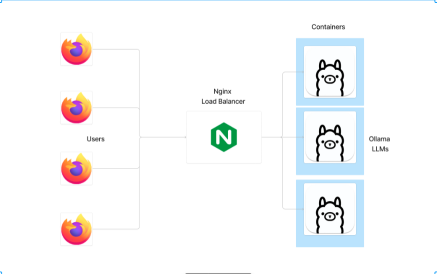

# CSL2090: Course Project

## Team Members
- Jyotin Goel (B22AI063)

# Local LLM hosting with load balancing

## Problem Statement:

- Creating a scalable local hosting environment for a large-scale application,
such as a Learning Management System (LLM), presents challenges in
efficiently managing user traffic.

- Implementing load balancers is crucial to distribute incoming requests across
multiple servers, ensuring optimal performance and reliability.

- This serves as a requirement for hosting custom models.

## Our Approach

1. Leveraging "Ollama" as our LLM host, we utilize quantized LLMs deployable on RAM,
employing three Docker containers to replicate user influx scenarios and test system scalability.
2. Introducing "jpt," our CLI tool facilitating communication with Docker containers via POST
calls, enabling streamlined retrieval of streaming responses.
3. Implementation of Nginx for load balancing, employing algorithms like round-robin and least
connections to optimize resource utilization and scalability, ensuring efficient system
performance.
4. Our approach integrates seamlessly orchestrated components, combining Ollama's quantized
LLMs, Docker containers, jpt CLI tool, and Nginx load balancer to create a robust, scalable
infrastructure for serving user demands effectively

## jpt "the CLI tool"

- Jpt is our cli tool written in go, this is so that the
users can connect to the hosted local llms in
their cli for usage like normal qa, coding doubts,
debugging, etc.

- Jpt helps in connecting the hosted local llms on
a network to multiple users

## Concepts used

- Round Robin, Least connection load balancing algorithms
- Docker containers, containerisation, etc.
- Sending requests
- Using cli
- Making cli tools
